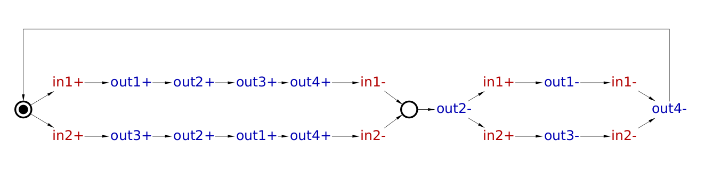
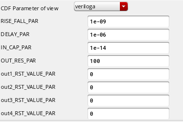
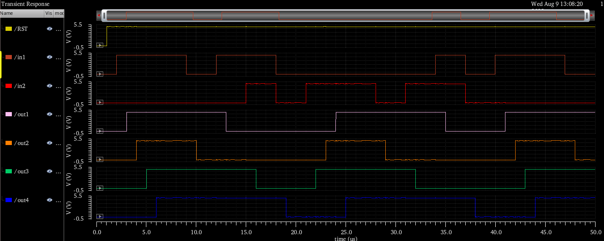

# stgToVerilogA

Mixed signal IPs often require some sort of asynchronous logic. This logic can be modeled by means of Signal Transition Graphs (STG) with the [workcraft](https://workcraft.org/) tool. The purpose of stgToVerilogA is to convert a non-synthesizable STG into a veriloga model in order to help with the specification and initial validation of analog IPs that depend on asynchronous logic. 

# Dependencies 

You will need to install [workcraft](https://workcraft.org/) and all the stgToVerilogA dependencies.
The dependencies can be installed by typing the following command on a terminal:

```
    pip3 install -r requirements
```

You can confirm that everything is working correctly by typing:

```
    python3 stgToVerilogA -h 
```

or:

```
    python3 stgToVerilogA example/STG.g
```

# Example

- After everything is set up, you can draw, as an example, the following STG using [workcraft](https://workcraft.org/):



stgToVerilogA relies on the assumptions of "consistency" and "deadlock freeness", but it doesn't check these properties. Therefore, you must run these checks using [workcraft](https://workcraft.org/). The STG must also be deterministic, so you don't get wrong results.

- Once the STG is finished and passes the checks, you can export the STG to a .g file by clicking on "file" -> "Export" -> "Signal Transition Graph (*.g)". The result of these steps will be a file similar to the one provided in the example folder ([STG.g](./example/STG.g)).

- You can now convert the .g file to a veriloga model:

```
    python3 stgToVerilogA example/STG.g
```

- stgToVerilogA isn't capable of inferring the initial states of the outputs. You need to set them manually through the parameters provided in the verilogA:



If the initial output states are wrong, the simulation will eventually throw a fatal error and stop.

- The simulation result of this example is shown below:




